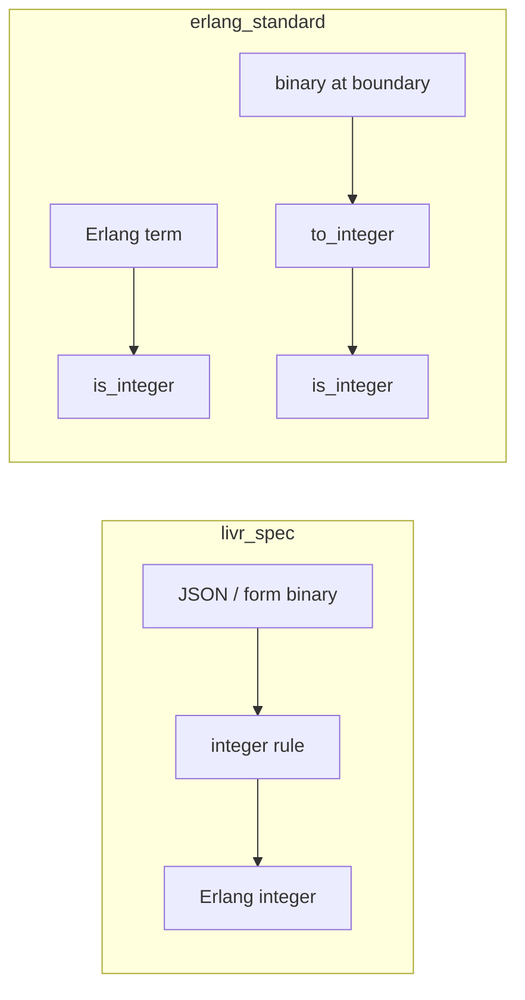

# Comparing `livr_spec` and `erlang_standard`

Liver is **inspired by [LIVR](http://livr-spec.org)** and implements a full
LIVR-compatible rule map. It also ships an Erlang-oriented default. This page
explains how they differ and **where “implicit conversion” comes from**.

| | **`livr_spec`** | **`erlang_standard`** (default) |
|--|-----------------|----------------------------------|
| Module | `liver_livr_rules` | `liver_standard_rules` |
| Docs | [livr_rules.md](livr_rules.md) | [standard_rules.md](standard_rules.md) |
| Naming | LIVR 2.0 (`integer`, `string`, …) | Erlang-ish (`is_integer`, `is_utf8_binary`, …) |
| Typical data | JSON / forms / HTTP bodies | OTP messages, DB rows, internal APIs |
| Type handling | Coerce when the LIVR rule says so | Check types; convert only via `to_*` |
| Error codes | Uppercase binaries (`<<"NOT_INTEGER">>`) | Lowercase atoms (`not_integer`, since **1.1.0**) |

They are not “Liver vs LIVR”. Both live in the same validator; you choose (or
compose) the rule map.

## Where implicit conversion comes from

In browser and many HTTP stacks, a JSON body or form field is often decoded so
that **numbers and booleans are still strings** at the edge, or the client sends
strings on purpose:

```text
{"age": "30"}     %% or form field age=30 as binary <<"30">>
```

LIVR was designed for that world. A rule named `integer` means:

1. accept an integer, **or**
2. parse a decimal-looking string into an integer, then continue.

So this succeeds under `livr_spec`:

```erlang
liver:validate(#{<<"age">> => integer},
               #{<<"age">> => <<"30">>},
               #{rule_set => livr_spec}).
%% {ok, #{<<"age">> => 30}}
```

The conversion is **part of the LIVR rule’s contract**, not a hidden Liver
global switch.

Inside an Erlang node you usually already have `30 :: integer()`. Silently
turning `<<"30">>` into `30` would hide contract bugs (wrong encoder, wrong
layer). Therefore `erlang_standard`’s `is_integer` **only** accepts integers:

```erlang
liver:validate(#{age => is_integer}, #{age => <<"30">>}).
%% {error, #{age => not_integer}}

liver:validate(#{age => [to_integer, is_integer]}, #{age => <<"30">>}).
%% {ok, #{age => 30}}
```

Here conversion is **visible in the schema** (`to_integer`).



## Naming and nesting

| Idea | LIVR | Standard |
|------|------|----------|
| Nested object | `nested_object` | `nested_map` / `nested_proplist` |
| List of values | `list_of` | `nested_list` |
| Membership | `one_of` | `one_of_terms` / `member` |
| String type | `string` | `is_utf8_binary` / `is_string` / `is_binary` |
| Text cleanup | `trim`, `to_lc`, … | no direct aliases; use converters / custom rules |

Same conceptual job, different vocabulary and type assumptions.

## Selecting a set

```erlang
%% Default — erlang_standard
liver:validate(Schema, Data).

%% Pure LIVR behaviour / upstream suite
liver:validate(Schema, Data, #{rule_set => livr_spec}).
liver:validate(Schema, Data, #{livr_compatible => true}).

%% Compose (first entry wins on name clash)
liver:validate(Schema, Data,
               #{rule_set => [livr_spec, erlang_standard]}).

liver:add_rule_set(my_app, #{slug => my_app_rules}).
liver:validate(Schema, Data,
               #{rule_set => [my_app, erlang_standard]}).
```

Aliases: `{mixed, erlang_standard}` → `[erlang_standard, livr_spec]`;
`{mixed, livr_spec}` → `[livr_spec, erlang_standard]`.

## When to use which

- **LIVR schemas, public JSON APIs, porting from JS/Perl LIVR** → `livr_spec`
- **Internal OTP services, already-typed terms** → `erlang_standard` (default)
- **JSON at the edge, Erlang types inward** → either coerce once with LIVR at
  the boundary, or decode JSON then use `to_*` + standard predicates
- **Project-specific checks** → `add_rule_set/2` / `add_rule/2`, usually first
  in the `rule_set` list

## Compatibility tests

`livr_rules_SUITE` runs with `#{rule_set => livr_spec}` against
`tests/cases/livr/` (imported LIVR fixtures).

## Historical note

From the first release Liver followed LIVR. A stricter Erlang-oriented set
grew later (`liver_strict_rules` → `liver_standard_rules`). In **1.0.0** that
set became the **default**; LIVR did not go away — it became an explicit
`rule_set`. The validate option `strict` (unknown fields) is unrelated to the
rule set name.
